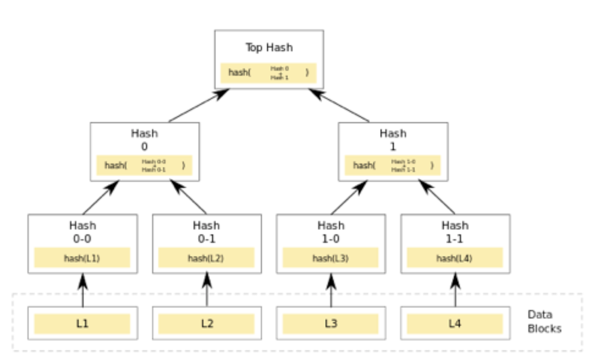

### Install Parcel for SCSS & SHA256 dependencies

      npm install parcel-bundler --save-dev
      npm install js-sha256

source SHA265 https://github.com/emn178/js-sha256

### Launch with :
      
      npm run dev

---

# The Merkle Tree on the Web

**Your mission**: implement a Merkle tree algorithm and an interface to use it.

_Note: you are free to use the programming language of your choice, and to make the design choices that you think are the most appropriate. You should be primarily concerned about ease of use and correctness._

## The Merkle Tree

A Merkle Tree is a relatively simple structure for checking data integrity. It is a binary tree where each node contains a cryptographic hash of its two children:

$H_parent = hash(H_left + H_right)$

If a node has only one child, its hash is the same as its child's hash.
The hash of the root of the tree is called the Merkle root. The leaves of the tree contain the data block hashes.

Write a class to create a Merkle tree from a series of data (in the illustration it would be the data L1, L2, L3, and L4).

The Merkle tree created must have the following methods:

- MerkleTree#root() // Returns the hash to the root of the tree
- MerkleTree#height() // Returns the number of tree levels
- MerkleTree#level(index) // Returns an Array containing the hashes of the specified level
      
PS: You can check the test suite to find examples.

## The Web interface

You should provide a web interface to allow users to input data and to call the previous methods of the tree. You're free to make all relevant decisions regarding the design and the user experience.
